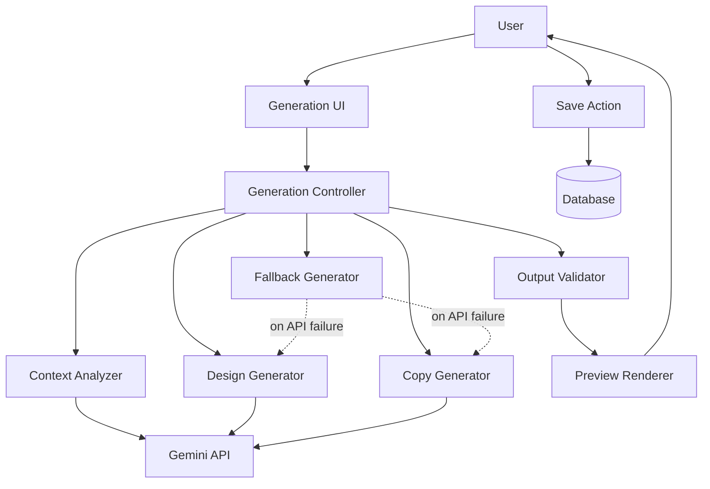
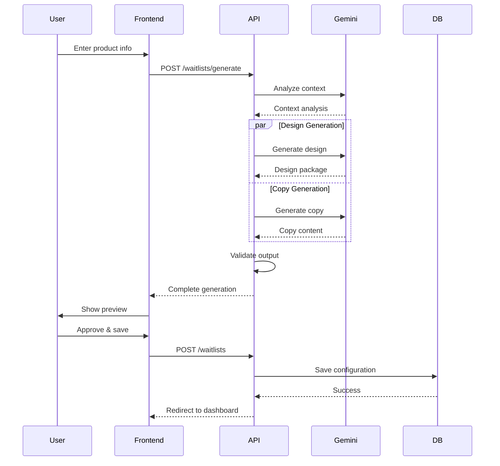

# Design Document: AI-Powered Waitlist Generator

## Overview

The AI-Powered Waitlist Generator transforms waitlist creation from a manual, multi-step process into an intelligent, automated workflow. Users provide minimal product information (name and description), and the system generates a complete, production-ready waitlist page including template selection, color schemes, typography, copy, and layout.

### Key Design Goals

1. **Speed**: Reduce time-to-publish from 15+ minutes to under 2 minutes
2. **Quality**: Generate professional, conversion-optimized designs automatically
3. **Simplicity**: Require minimal user input while producing comprehensive output
4. **Flexibility**: Support regeneration and manual refinement after AI generation
5. **Reliability**: Gracefully handle API failures with intelligent fallbacks

### System Context

The AI generator integrates with existing WaitlistFast infrastructure:
- **Template System**: 5 pre-built templates (minimal, bold, startup, product, comingSoon)
- **Customization System**: Colors, fonts, backgrounds, logos, features, social links
- **Database Schema**: Existing waitlists table with customization columns
- **Gemini Integration**: Existing `server/gemini.ts` module for AI generation

## Architecture

### High-Level Architecture



### Component Architecture

The system follows a pipeline architecture with three main stages:

1. **Context Analysis Stage**: Analyzes product information to determine industry, tone, and audience
2. **Generation Stage**: Produces design package and copy content in parallel
3. **Validation Stage**: Validates output quality and ensures consistency

### Data Flow



## Components and Interfaces

### 1. Generation Controller (`server/services/generation.service.ts`)

Primary orchestrator for the AI generation pipeline.

```typescript
interface GenerationRequest {
  productName: string;
  shortDescription: string;
  industry?: string;
  targetAudience?: string;
}

interface GenerationResponse {
  design: DesignPackage;
  copy: CopyContent;
  slug: string;
  metadata: GenerationMetadata;
}

interface DesignPackage {
  template: TemplateId;
  primaryColor: string;
  fontFamily: FontPairId;
  backgroundType: 'solid' | 'gradient' | 'image';
  backgroundValue: string;
  showCounter: boolean;
}

interface CopyContent {
  headline: string;
  tagline: string;
  description: string;
  ctaText: string;
  features?: Feature[];
}

interface Feature {
  icon: string;
  title: string;
  description: string;
}

interface GenerationMetadata {
  generatedAt: number;
  generationDuration: number;
  usedFallback: boolean;
  confidence: number;
}

class GenerationService {
  async generate(request: GenerationRequest): Promise<GenerationResponse>
  async regenerate(request: GenerationRequest, previousResult: GenerationResponse): Promise<GenerationResponse>
  async refine(request: GenerationRequest, adjustmentPrompt: string, currentResult: GenerationResponse): Promise<GenerationResponse>
}
```

### 2. Context Analyzer (`server/services/context-analyzer.service.ts`)

Analyzes product information to extract meaningful context for generation.

```typescript
interface ProductContext {
  category: ProductCategory;
  industry: Industry;
  tone: Tone;
  targetAudience: AudienceType;
  keywords: string[];
}

type ProductCategory = 'saas' | 'ecommerce' | 'mobile-app' | 'b2b' | 'b2c' | 'marketplace' | 'tool' | 'platform';
type Industry = 'tech' | 'finance' | 'health' | 'education' | 'entertainment' | 'productivity' | 'social' | 'other';
type Tone = 'professional' | 'casual' | 'playful' | 'technical' | 'friendly' | 'bold';
type AudienceType = 'developers' | 'business' | 'consumers' | 'students' | 'creators' | 'general';

class ContextAnalyzerService {
  async analyze(request: GenerationRequest): Promise<ProductContext>
  private extractKeywords(description: string): string[]
  private determineCategory(name: string, description: string, keywords: string[]): ProductCategory
  private determineTone(context: ProductContext): Tone
}
```

### 3. Design Generator (`server/services/design-generator.service.ts`)

Generates complete design packages based on product context.

```typescript
interface DesignGenerationPrompt {
  context: ProductContext;
  request: GenerationRequest;
}

interface TemplateSelectionReasoning {
  selectedTemplate: TemplateId;
  reason: string;
  confidence: number;
}

class DesignGeneratorService {
  async generateDesign(prompt: DesignGenerationPrompt): Promise<DesignPackage>
  private selectTemplate(context: ProductContext): TemplateId
  private generateColorScheme(context: ProductContext, template: TemplateId): ColorScheme
  private selectFontPair(context: ProductContext, tone: Tone): FontPairId
  private generateBackground(template: TemplateId, colors: ColorScheme): Background
  private validateContrast(colors: ColorScheme): boolean
}

interface ColorScheme {
  primary: string;
  background: string;
  text: string;
  textSecondary: string;
}

interface Background {
  type: 'solid' | 'gradient' | 'image';
  value: string;
}
```

### 4. Copy Generator (`server/services/copy-generator.service.ts`)

Generates compelling, conversion-focused copy content.

```typescript
interface CopyGenerationPrompt {
  context: ProductContext;
  request: GenerationRequest;
  template: TemplateId;
}

class CopyGeneratorService {
  async generateCopy(prompt: CopyGenerationPrompt): Promise<CopyContent>
  private generateHeadline(context: ProductContext, productName: string): string
  private generateTagline(context: ProductContext, description: string): string
  private generateDescription(context: ProductContext, description: string): string
  private generateCTA(context: ProductContext, tone: Tone): string
  private generateFeatures(context: ProductContext, template: TemplateId): Feature[]
  private validateCopyLength(copy: CopyContent): boolean
}
```

### 5. Gemini Integration Service (`server/services/gemini-integration.service.ts`)

Handles all interactions with the Gemini API with retry logic and error handling.

```typescript
interface GeminiRequest {
  prompt: string;
  temperature?: number;
  maxTokens?: number;
  responseFormat?: 'json' | 'text';
}

interface GeminiResponse<T> {
  data: T;
  usage: TokenUsage;
  duration: number;
}

interface TokenUsage {
  promptTokens: number;
  completionTokens: number;
  totalTokens: number;
}

class GeminiIntegrationService {
  async generateJSON<T>(request: GeminiRequest): Promise<GeminiResponse<T>>
  async generateText(request: GeminiRequest): Promise<GeminiResponse<string>>
  private parseJSONResponse(text: string): any
  private retryWithBackoff<T>(fn: () => Promise<T>, maxRetries: number): Promise<T>
  private handleAPIError(error: any): void
}
```

### 6. Fallback Generator (`server/services/fallback-generator.service.ts`)

Provides intelligent fallback generation when Gemini API is unavailable.

```typescript
class FallbackGeneratorService {
  generateDesign(request: GenerationRequest): DesignPackage
  generateCopy(request: GenerationRequest): CopyContent
  generateSlug(productName: string): string
  private selectDefaultTemplate(): TemplateId
  private generateDefaultColors(): ColorScheme
  private selectDefaultFont(): FontPairId
}
```

### 7. Output Validator (`server/services/output-validator.service.ts`)

Validates generated output for quality and correctness.

```typescript
interface ValidationResult {
  valid: boolean;
  errors: ValidationError[];
  warnings: ValidationWarning[];
}

interface ValidationError {
  field: string;
  message: string;
  severity: 'error' | 'warning';
}

type ValidationWarning = ValidationError;

class OutputValidatorService {
  validate(response: GenerationResponse): ValidationResult
  private validateDesign(design: DesignPackage): ValidationError[]
  private validateCopy(copy: CopyContent): ValidationError[]
  private validateSlug(slug: string): ValidationError[]
  private validateColorContrast(colors: ColorScheme): ValidationError[]
  private validateCopyLength(copy: CopyContent): ValidationError[]
}
```

### 8. Frontend Generation UI (`src/pages/CreateWaitlist.tsx`)

Enhanced UI for AI-powered generation with preview and refinement.

```typescript
interface GenerationState {
  step: 'input' | 'generating' | 'preview' | 'refining';
  productName: string;
  shortDescription: string;
  generated: GenerationResponse | null;
  generating: boolean;
  error: string | null;
  manualEdits: Partial<GenerationResponse> | null;
}

function CreateWaitlist() {
  const [state, setState] = useState<GenerationState>({
    step: 'input',
    productName: '',
    shortDescription: '',
    generated: null,
    generating: false,
    error: null,
    manualEdits: null,
  });

  async function handleGenerate(): Promise<void>
  async function handleRegenerate(): Promise<void>
  async function handleSave(): Promise<void>
  function handleManualEdit(field: string, value: any): void
  function renderPreview(): JSX.Element
}
```

### 9. Preview Renderer (`src/components/generation/PreviewRenderer.tsx`)

Renders live preview of generated waitlist with all customizations applied.

```typescript
interface PreviewRendererProps {
  design: DesignPackage;
  copy: CopyContent;
  slug: string;
  responsive?: boolean;
}

function PreviewRenderer({ design, copy, slug, responsive }: PreviewRendererProps) {
  const [viewMode, setViewMode] = useState<'desktop' | 'tablet' | 'mobile'>('desktop');
  
  function renderTemplate(): JSX.Element
  function applyCustomizations(): CSSProperties
}
```

### 10. API Endpoints

New endpoints for AI generation:

```typescript
// POST /api/waitlists/generate
// Generate complete waitlist configuration from product info
router.post('/waitlists/generate', authenticate, async (req, res) => {
  const { productName, shortDescription, industry, targetAudience } = req.body;
  // Returns GenerationResponse
});

// POST /api/waitlists/regenerate
// Regenerate with same inputs but different output
router.post('/waitlists/regenerate', authenticate, async (req, res) => {
  const { productName, shortDescription, previousResult } = req.body;
  // Returns GenerationResponse
});

// POST /api/waitlists/refine
// Refine specific aspects with natural language
router.post('/waitlists/refine', authenticate, async (req, res) => {
  const { adjustmentPrompt, currentResult } = req.body;
  // Returns GenerationResponse
});

// POST /api/waitlists/validate-slug
// Check if slug is available
router.post('/waitlists/validate-slug', authenticate, async (req, res) => {
  const { slug } = req.body;
  // Returns { available: boolean, suggestion?: string }
});
```

## Data Models

### Database Schema

No changes required to existing schema. The generated configuration maps directly to existing `waitlists` table columns:

```sql
-- Existing schema (no changes needed)
CREATE TABLE waitlists (
  id TEXT PRIMARY KEY,
  user_id TEXT NOT NULL,
  slug TEXT UNIQUE NOT NULL,
  name TEXT NOT NULL,
  description TEXT NOT NULL,
  logo_url TEXT,
  template TEXT DEFAULT 'minimal',              -- AI-generated
  primary_color TEXT DEFAULT '#18181b',         -- AI-generated
  font_family TEXT DEFAULT 'inter',             -- AI-generated
  background_type TEXT DEFAULT 'solid',         -- AI-generated
  background_value TEXT DEFAULT '#FAFAFA',      -- AI-generated
  cta_text TEXT DEFAULT 'Join the waitlist',    -- AI-generated
  show_counter INTEGER DEFAULT 1,               -- AI-generated
  custom_css TEXT,
  custom_domain TEXT,
  features_json TEXT,                           -- AI-generated
  social_links_json TEXT,
  created_at INTEGER NOT NULL,
  FOREIGN KEY (user_id) REFERENCES users(id) ON DELETE CASCADE
);
```

### Generation Metadata Storage (Optional)

For tracking and analytics, we can add an optional table:

```sql
CREATE TABLE IF NOT EXISTS generation_logs (
  id TEXT PRIMARY KEY,
  user_id TEXT NOT NULL,
  waitlist_id TEXT,
  product_name TEXT NOT NULL,
  product_description TEXT NOT NULL,
  generation_duration INTEGER NOT NULL,
  used_fallback INTEGER DEFAULT 0,
  template_selected TEXT,
  regeneration_count INTEGER DEFAULT 0,
  created_at INTEGER NOT NULL,
  FOREIGN KEY (user_id) REFERENCES users(id) ON DELETE CASCADE,
  FOREIGN KEY (waitlist_id) REFERENCES waitlists(id) ON DELETE SET NULL
);

CREATE INDEX IF NOT EXISTS idx_generation_logs_user ON generation_logs(user_id);
CREATE INDEX IF NOT EXISTS idx_generation_logs_created ON generation_logs(created_at);
```

### In-Memory Data Structures

```typescript
// Template selection rules
const TEMPLATE_RULES: Record<ProductCategory, TemplateId> = {
  'saas': 'minimal',
  'b2b': 'startup',
  'ecommerce': 'product',
  'mobile-app': 'bold',
  'b2c': 'bold',
  'marketplace': 'product',
  'tool': 'minimal',
  'platform': 'startup',
};

// Industry color palettes
const INDUSTRY_COLORS: Record<Industry, string[]> = {
  'tech': ['#6366f1', '#8b5cf6', '#0ea5e9', '#06b6d4'],
  'finance': ['#10b981', '#059669', '#0ea5e9', '#1e40af'],
  'health': ['#ef4444', '#f59e0b', '#10b981', '#06b6d4'],
  'education': ['#f59e0b', '#eab308', '#84cc16', '#22c55e'],
  'entertainment': ['#ec4899', '#a855f7', '#f43f5e', '#fb923c'],
  'productivity': ['#6366f1', '#8b5cf6', '#0ea5e9', '#10b981'],
  'social': ['#ec4899', '#f43f5e', '#f59e0b', '#8b5cf6'],
  'other': ['#18181b', '#6366f1', '#0ea5e9', '#10b981'],
};

// Tone-based font pairings
const TONE_FONTS: Record<Tone, FontPairId> = {
  'professional': 'inter',
  'casual': 'outfit',
  'playful': 'poppins',
  'technical': 'dm-sans',
  'friendly': 'outfit',
  'bold': 'space',
};
```


## Correctness Properties

*A property is a characteristic or behavior that should hold true across all valid executions of a system—essentially, a formal statement about what the system should do. Properties serve as the bridge between human-readable specifications and machine-verifiable correctness guarantees.*

