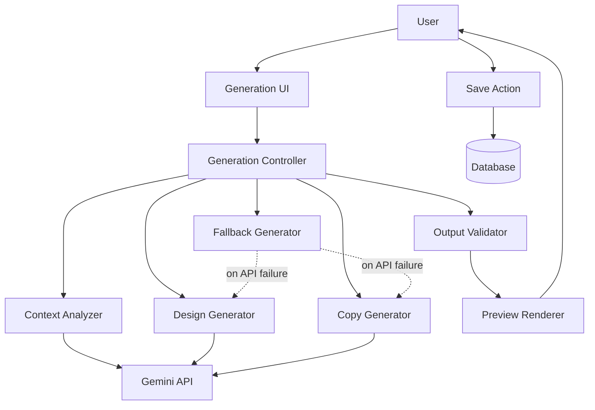
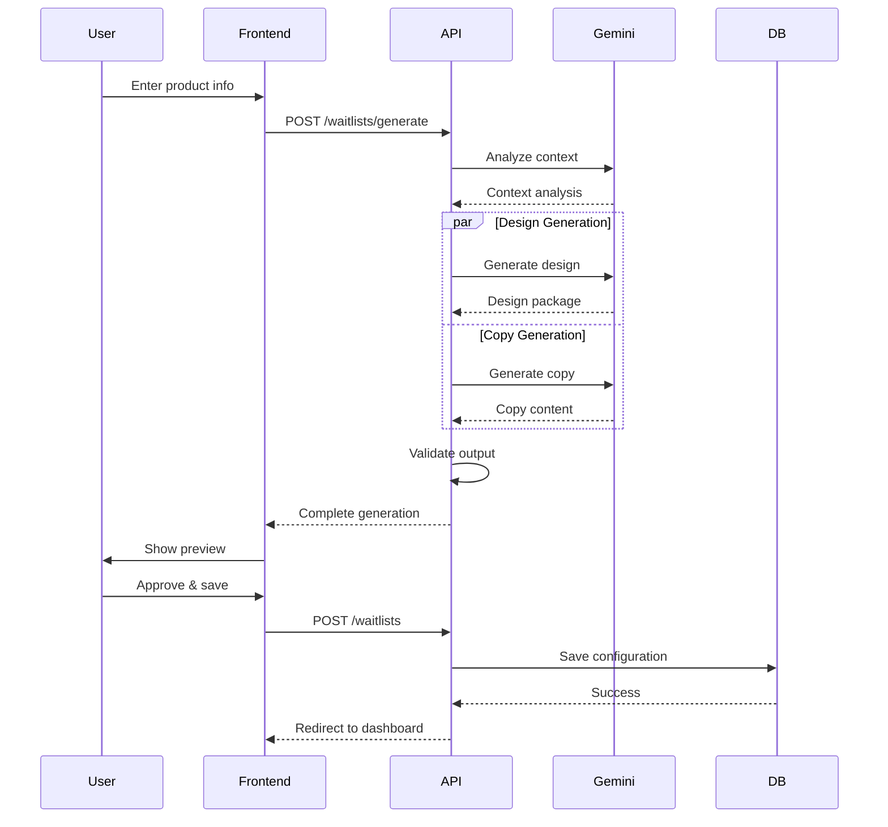

# Design Document: AI-Powered Waitlist Generator

## Overview

The AI-Powered Waitlist Generator transforms waitlist creation from a manual, multi-step process into an intelligent, automated workflow. Users provide minimal product information (name and description), and the system generates a complete, production-ready waitlist page including template selection, color schemes, typography, copy, and layout.

### Key Design Goals

1. **Speed**: Reduce time-to-publish from 15+ minutes to under 2 minutes
2. **Quality**: Generate professional, conversion-optimized designs automatically
3. **Simplicity**: Require minimal user input while producing comprehensive output
4. **Flexibility**: Support regeneration and manual refinement after AI generation
5. **Reliability**: Gracefully handle API failures with intelligent fallbacks

### System Context

The AI generator integrates with existing WaitlistFast infrastructure:
- **Template System**: 5 pre-built templates (minimal, bold, startup, product, comingSoon)
- **Customization System**: Colors, fonts, backgrounds, logos, features, social links
- **Database Schema**: Existing waitlists table with customization columns
- **Gemini Integration**: Existing `server/gemini.ts` module for AI generation

## Architecture

### High-Level Architecture



### Component Architecture

The system follows a pipeline architecture with three main stages:

1. **Context Analysis Stage**: Analyzes product information to determine industry, tone, and audience
2. **Generation Stage**: Produces design package and copy content in parallel
3. **Validation Stage**: Validates output quality and ensures consistency

### Data Flow



## Components and Interfaces

### 1. Generation Controller (`server/services/generation.service.ts`)

Primary orchestrator for the AI generation pipeline.

```typescript
interface GenerationRequest {
  productName: string;
  shortDescription: string;
  industry?: string;
  targetAudience?: string;
}

interface GenerationResponse {
  design: DesignPackage;
  copy: CopyContent;
  slug: string;
  metadata: GenerationMetadata;
}

interface DesignPackage {
  template: TemplateId;
  primaryColor: string;
  fontFamily: FontPairId;
  backgroundType: 'solid' | 'gradient' | 'image';
  backgroundValue: string;
  showCounter: boolean;
}

interface CopyContent {
  headline: string;
  tagline: string;
  description: string;
  ctaText: string;
  features?: Feature[];
}

interface Feature {
  icon: string;
  title: string;
  description: string;
}

interface GenerationMetadata {
  generatedAt: number;
  generationDuration: number;
  usedFallback: boolean;
  confidence: number;
}

class GenerationService {
  async generate(request: GenerationRequest): Promise<GenerationResponse>
  async regenerate(request: GenerationRequest, previousResult: GenerationResponse): Promise<GenerationResponse>
  async refine(request: GenerationRequest, adjustmentPrompt: string, currentResult: GenerationResponse): Promise<GenerationResponse>
}
```

### 2. Context Analyzer (`server/services/context-analyzer.service.ts`)

Analyzes product information to extract meaningful context for generation.

```typescript
interface ProductContext {
  category: ProductCategory;
  industry: Industry;
  tone: Tone;
  targetAudience: AudienceType;
  keywords: string[];
}

type ProductCategory = 'saas' | 'ecommerce' | 'mobile-app' | 'b2b' | 'b2c' | 'marketplace' | 'tool' | 'platform';
type Industry = 'tech' | 'finance' | 'health' | 'education' | 'entertainment' | 'productivity' | 'social' | 'other';
type Tone = 'professional' | 'casual' | 'playful' | 'technical' | 'friendly' | 'bold';
type AudienceType = 'developers' | 'business' | 'consumers' | 'students' | 'creators' | 'general';

class ContextAnalyzerService {
  async analyze(request: GenerationRequest): Promise<ProductContext>
  private extractKeywords(description: string): string[]
  private determineCategory(name: string, description: string, keywords: string[]): ProductCategory
  private determineTone(context: ProductContext): Tone
}
```

### 3. Design Generator (`server/services/design-generator.service.ts`)

Generates complete design packages based on product context.

```typescript
interface DesignGenerationPrompt {
  context: ProductContext;
  request: GenerationRequest;
}

interface TemplateSelectionReasoning {
  selectedTemplate: TemplateId;
  reason: string;
  confidence: number;
}

class DesignGeneratorService {
  async generateDesign(prompt: DesignGenerationPrompt): Promise<DesignPackage>
  private selectTemplate(context: ProductContext): TemplateId
  private generateColorScheme(context: ProductContext, template: TemplateId): ColorScheme
  private selectFontPair(context: ProductContext, tone: Tone): FontPairId
  private generateBackground(template: TemplateId, colors: ColorScheme): Background
  private validateContrast(colors: ColorScheme): boolean
}

interface ColorScheme {
  primary: string;
  background: string;
  text: string;
  textSecondary: string;
}

interface Background {
  type: 'solid' | 'gradient' | 'image';
  value: string;
}
```

### 4. Copy Generator (`server/services/copy-generator.service.ts`)

Generates compelling, conversion-focused copy content.

```typescript
interface CopyGenerationPrompt {
  context: ProductContext;
  request: GenerationRequest;
  template: TemplateId;
}

class CopyGeneratorService {
  async generateCopy(prompt: CopyGenerationPrompt): Promise<CopyContent>
  private generateHeadline(context: ProductContext, productName: string): string
  private generateTagline(context: ProductContext, description: string): string
  private generateDescription(context: ProductContext, description: string): string
  private generateCTA(context: ProductContext, tone: Tone): string
  private generateFeatures(context: ProductContext, template: TemplateId): Feature[]
  private validateCopyLength(copy: CopyContent): boolean
}
```

### 5. Gemini Integration Service (`server/services/gemini-integration.service.ts`)

Handles all interactions with the Gemini API with retry logic and error handling.

```typescript
interface GeminiRequest {
  prompt: string;
  temperature?: number;
  maxTokens?: number;
  responseFormat?: 'json' | 'text';
}

interface GeminiResponse<T> {
  data: T;
  usage: TokenUsage;
  duration: number;
}

interface TokenUsage {
  promptTokens: number;
  completionTokens: number;
  totalTokens: number;
}

class GeminiIntegrationService {
  async generateJSON<T>(request: GeminiRequest): Promise<GeminiResponse<T>>
  async generateText(request: GeminiRequest): Promise<GeminiResponse<string>>
  private parseJSONResponse(text: string): any
  private retryWithBackoff<T>(fn: () => Promise<T>, maxRetries: number): Promise<T>
  private handleAPIError(error: any): void
}
```

### 6. Fallback Generator (`server/services/fallback-generator.service.ts`)

Provides intelligent fallback generation when Gemini API is unavailable.

```typescript
class FallbackGeneratorService {
  generateDesign(request: GenerationRequest): DesignPackage
  generateCopy(request: GenerationRequest): CopyContent
  generateSlug(productName: string): string
  private selectDefaultTemplate(): TemplateId
  private generateDefaultColors(): ColorScheme
  private selectDefaultFont(): FontPairId
}
```

### 7. Output Validator (`server/services/output-validator.service.ts`)

Validates generated output for quality and correctness.

```typescript
interface ValidationResult {
  valid: boolean;
  errors: ValidationError[];
  warnings: ValidationWarning[];
}

interface ValidationError {
  field: string;
  message: string;
  severity: 'error' | 'warning';
}

type ValidationWarning = ValidationError;

class OutputValidatorService {
  validate(response: GenerationResponse): ValidationResult
  private validateDesign(design: DesignPackage): ValidationError[]
  private validateCopy(copy: CopyContent): ValidationError[]
  private validateSlug(slug: string): ValidationError[]
  private validateColorContrast(colors: ColorScheme): ValidationError[]
  private validateCopyLength(copy: CopyContent): ValidationError[]
}
```

### 8. Frontend Generation UI (`src/pages/CreateWaitlist.tsx`)

Enhanced UI for AI-powered generation with preview and refinement.

```typescript
interface GenerationState {
  step: 'input' | 'generating' | 'preview' | 'refining';
  productName: string;
  shortDescription: string;
  generated: GenerationResponse | null;
  generating: boolean;
  error: string | null;
  manualEdits: Partial<GenerationResponse> | null;
}

function CreateWaitlist() {
  const [state, setState] = useState<GenerationState>({
    step: 'input',
    productName: '',
    shortDescription: '',
    generated: null,
    generating: false,
    error: null,
    manualEdits: null,
  });

  async function handleGenerate(): Promise<void>
  async function handleRegenerate(): Promise<void>
  async function handleSave(): Promise<void>
  function handleManualEdit(field: string, value: any): void
  function renderPreview(): JSX.Element
}
```

### 9. Preview Renderer (`src/components/generation/PreviewRenderer.tsx`)

Renders live preview of generated waitlist with all customizations applied.

```typescript
interface PreviewRendererProps {
  design: DesignPackage;
  copy: CopyContent;
  slug: string;
  responsive?: boolean;
}

function PreviewRenderer({ design, copy, slug, responsive }: PreviewRendererProps) {
  const [viewMode, setViewMode] = useState<'desktop' | 'tablet' | 'mobile'>('desktop');
  
  function renderTemplate(): JSX.Element
  function applyCustomizations(): CSSProperties
}
```

### 10. API Endpoints

New endpoints for AI generation:

```typescript
// POST /api/waitlists/generate
// Generate complete waitlist configuration from product info
router.post('/waitlists/generate', authenticate, async (req, res) => {
  const { productName, shortDescription, industry, targetAudience } = req.body;
  // Returns GenerationResponse
});

// POST /api/waitlists/regenerate
// Regenerate with same inputs but different output
router.post('/waitlists/regenerate', authenticate, async (req, res) => {
  const { productName, shortDescription, previousResult } = req.body;
  // Returns GenerationResponse
});

// POST /api/waitlists/refine
// Refine specific aspects with natural language
router.post('/waitlists/refine', authenticate, async (req, res) => {
  const { adjustmentPrompt, currentResult } = req.body;
  // Returns GenerationResponse
});

// POST /api/waitlists/validate-slug
// Check if slug is available
router.post('/waitlists/validate-slug', authenticate, async (req, res) => {
  const { slug } = req.body;
  // Returns { available: boolean, suggestion?: string }
});
```

## Data Models

### Database Schema

No changes required to existing schema. The generated configuration maps directly to existing `waitlists` table columns:

```sql
-- Existing schema (no changes needed)
CREATE TABLE waitlists (
  id TEXT PRIMARY KEY,
  user_id TEXT NOT NULL,
  slug TEXT UNIQUE NOT NULL,
  name TEXT NOT NULL,
  description TEXT NOT NULL,
  logo_url TEXT,
  template TEXT DEFAULT 'minimal',              -- AI-generated
  primary_color TEXT DEFAULT '#18181b',         -- AI-generated
  font_family TEXT DEFAULT 'inter',             -- AI-generated
  background_type TEXT DEFAULT 'solid',         -- AI-generated
  background_value TEXT DEFAULT '#FAFAFA',      -- AI-generated
  cta_text TEXT DEFAULT 'Join the waitlist',    -- AI-generated
  show_counter INTEGER DEFAULT 1,               -- AI-generated
  custom_css TEXT,
  custom_domain TEXT,
  features_json TEXT,                           -- AI-generated
  social_links_json TEXT,
  created_at INTEGER NOT NULL,
  FOREIGN KEY (user_id) REFERENCES users(id) ON DELETE CASCADE
);
```

### Generation Metadata Storage (Optional)

For tracking and analytics, we can add an optional table:

```sql
CREATE TABLE IF NOT EXISTS generation_logs (
  id TEXT PRIMARY KEY,
  user_id TEXT NOT NULL,
  waitlist_id TEXT,
  product_name TEXT NOT NULL,
  product_description TEXT NOT NULL,
  generation_duration INTEGER NOT NULL,
  used_fallback INTEGER DEFAULT 0,
  template_selected TEXT,
  regeneration_count INTEGER DEFAULT 0,
  created_at INTEGER NOT NULL,
  FOREIGN KEY (user_id) REFERENCES users(id) ON DELETE CASCADE,
  FOREIGN KEY (waitlist_id) REFERENCES waitlists(id) ON DELETE SET NULL
);

CREATE INDEX IF NOT EXISTS idx_generation_logs_user ON generation_logs(user_id);
CREATE INDEX IF NOT EXISTS idx_generation_logs_created ON generation_logs(created_at);
```

### In-Memory Data Structures

```typescript
// Template selection rules
const TEMPLATE_RULES: Record<ProductCategory, TemplateId> = {
  'saas': 'minimal',
  'b2b': 'startup',
  'ecommerce': 'product',
  'mobile-app': 'bold',
  'b2c': 'bold',
  'marketplace': 'product',
  'tool': 'minimal',
  'platform': 'startup',
};

// Industry color palettes
const INDUSTRY_COLORS: Record<Industry, string[]> = {
  'tech': ['#6366f1', '#8b5cf6', '#0ea5e9', '#06b6d4'],
  'finance': ['#10b981', '#059669', '#0ea5e9', '#1e40af'],
  'health': ['#ef4444', '#f59e0b', '#10b981', '#06b6d4'],
  'education': ['#f59e0b', '#eab308', '#84cc16', '#22c55e'],
  'entertainment': ['#ec4899', '#a855f7', '#f43f5e', '#fb923c'],
  'productivity': ['#6366f1', '#8b5cf6', '#0ea5e9', '#10b981'],
  'social': ['#ec4899', '#f43f5e', '#f59e0b', '#8b5cf6'],
  'other': ['#18181b', '#6366f1', '#0ea5e9', '#10b981'],
};

// Tone-based font pairings
const TONE_FONTS: Record<Tone, FontPairId> = {
  'professional': 'inter',
  'casual': 'outfit',
  'playful': 'poppins',
  'technical': 'dm-sans',
  'friendly': 'outfit',
  'bold': 'space',
};
```


## Correctness Properties

*A property is a characteristic or behavior that should hold true across all valid executions of a system—essentially, a formal statement about what the system should do. Properties serve as the bridge between human-readable specifications and machine-verifiable correctness guarantees.*


### Property 1: Input Validation Bounds

*For any* product name input, the validation should accept strings between 1 and 100 characters and reject strings outside this range.

*For any* product description input, the validation should accept strings between 10 and 500 characters and reject strings outside this range.

**Validates: Requirements 1.5, 1.6**

### Property 2: Input Preservation on Failure

*For any* generation request that fails, the original user input (product name, description, industry, target audience) should remain unchanged and available for retry.

**Validates: Requirements 1.8**

### Property 3: Context Analysis Completeness

*For any* valid generation request, the context analyzer should produce all required context fields: category, industry, tone, and target audience.

**Validates: Requirements 2.1, 2.2, 2.3, 2.4**

### Property 4: Fallback on Analysis Failure

*For any* generation request where context analysis fails, the system should use neutral defaults and continue generation rather than failing completely.

**Validates: Requirements 2.6**

### Property 5: Valid Template Selection

*For any* generated design package, the selected template must be one of the valid templates in the Template_System (minimal, bold, startup, product, comingSoon).

**Validates: Requirements 3.1, 16.4**

### Property 6: Valid Color Format

*For any* generated design package, the primary color and background color (if solid) must be valid hex color codes matching the pattern #[0-9A-Fa-f]{6}.

**Validates: Requirements 3.2, 16.1**

### Property 7: Valid Font Selection

*For any* generated design package, the selected font family must be one of the valid font options in the available font pairings.

**Validates: Requirements 3.3, 16.5**

### Property 8: Valid Background Type

*For any* generated design package, the background type must be one of: 'solid', 'gradient', or 'image'.

**Validates: Requirements 3.4**

### Property 9: Background Value Format Validity

*For any* generated design package, the background value must be valid for its type: hex color for solid, gradient CSS for gradient, or URL for image.

**Validates: Requirements 3.5**

### Property 10: WCAG AA Contrast Compliance

*For any* generated color scheme, the contrast ratio between text color and background color must meet WCAG AA standards (minimum 4.5:1 for normal text, 3:1 for large text).

**Validates: Requirements 3.6**

### Property 11: Template Selection Rules

*For any* product context with a determined category, the selected template should follow the template selection rules (SaaS→minimal, B2B→startup, e-commerce→product, consumer apps→bold, pre-launch→comingSoon).

**Validates: Requirements 3.7**

### Property 12: Design Package Completeness

*For any* generated design package, all required fields must be present: template, primaryColor, fontFamily, backgroundType, backgroundValue, showCounter.

**Validates: Requirements 3.8**

### Property 13: Copy Length Constraints

*For any* generated copy content:
- Headline length must be between 30 and 80 characters
- Description length must be between 100 and 300 characters
- CTA text length must be between 10 and 30 characters

**Validates: Requirements 4.1, 4.3, 4.4, 16.3**

### Property 14: Feature Highlights Structure

*For any* generated copy content that includes features, there must be between 3 and 5 features, and each feature must have an icon, title, and description.

**Validates: Requirements 4.5**

### Property 15: Conditional Testimonial Generation

*For any* generation where the selected template supports social proof (startup, product), the copy content should include testimonial content.

**Validates: Requirements 4.6**

### Property 16: Slug Format Validity

*For any* generated URL slug, it must:
- Contain only lowercase letters, numbers, and hyphens
- Be between 3 and 50 characters in length
- Not start or end with a hyphen

**Validates: Requirements 5.1, 5.2, 5.3, 16.2**

### Property 17: Slug Special Character Removal

*For any* product name containing special characters or spaces, the generated slug must have all special characters removed and spaces replaced with hyphens.

**Validates: Requirements 5.4, 18.1**

### Property 18: Slug Uniqueness Enforcement

*For any* generated slug that already exists in the database, the system must append a numeric suffix to ensure uniqueness.

**Validates: Requirements 5.5, 5.6, 10.5, 18.5**

### Property 19: JSON Response Parsing

*For any* valid JSON response from Gemini API (with or without markdown code blocks), the parser should successfully extract and parse the JSON content.

**Validates: Requirements 6.3, 6.4**

### Property 20: API Failure Fallback

*For any* generation request where Gemini API is unavailable, returns invalid JSON after retries, times out, or exceeds quota, the system should use fallback generation logic.

**Validates: Requirements 6.5, 6.6, 6.8, 11.1, 18.6**

### Property 21: API Error Logging

*For any* Gemini API error or validation failure, the system should create a log entry with error details for debugging and monitoring.

**Validates: Requirements 6.9, 16.8**

### Property 22: Preview Content Completeness

*For any* generated waitlist, the preview mode should display all generated content: headline, description, CTA, colors, fonts, background, and URL slug.

**Validates: Requirements 7.2, 7.3, 7.4, 7.6**

### Property 23: Conditional Feature Display

*For any* generated waitlist with feature highlights, the preview mode should display all features with their icons, titles, and descriptions.

**Validates: Requirements 7.5**

### Property 24: Regeneration Input Preservation

*For any* regeneration request, the system should use the same product context (name, description, industry, audience) as the original generation.

**Validates: Requirements 8.3**

### Property 25: Regeneration Output Variation

*For any* two consecutive regenerations with identical input, the generated design packages should differ in at least one design choice (template, colors, or fonts).

**Validates: Requirements 8.4**

### Property 26: Manual Edit Preservation on Regeneration

*For any* regeneration request where manual edits exist, the system should preserve those manual edits and only regenerate non-edited fields.

**Validates: Requirements 8.8**

### Property 27: Manual Edit Warning

*For any* regeneration attempt when manual edits exist, the system should display a warning to the user before proceeding.

**Validates: Requirements 9.8**

### Property 28: Real-time Preview Updates

*For any* manual change to design or copy fields, the preview mode should update immediately to reflect the change.

**Validates: Requirements 9.6**

### Property 29: Manual Edit Persistence

*For any* manual changes made to the generated configuration, those changes should be preserved when saving to the database.

**Validates: Requirements 9.7**

### Property 30: Complete Data Persistence

*For any* approved waitlist configuration, all design package values, copy content values, and the URL slug should be saved to the database.

**Validates: Requirements 10.1, 10.2, 10.3, 10.4**

### Property 31: Save Failure State Preservation

*For any* save operation that fails, the system should display an error message and preserve the complete configuration for retry.

**Validates: Requirements 10.7**

### Property 32: Fallback Generation Completeness

*For any* fallback generation (when AI is unavailable), the system should produce a complete, valid design package with minimal template, neutral colors, standard fonts, and a valid slug.

**Validates: Requirements 11.2, 11.3, 11.4, 11.5, 11.8**

### Property 33: Fallback Copy Usage

*For any* fallback generation, the system should use the user-provided description as the page copy content.

**Validates: Requirements 11.6**

### Property 34: Fallback Notification

*For any* generation that uses fallback logic, the system should inform the user that AI generation was unavailable.

**Validates: Requirements 11.7**

### Property 35: Validation Before Preview

*For any* generation, the system should validate all generated values (colors, slugs, copy lengths, template, fonts) before displaying the preview mode.

**Validates: Requirements 16.7**

### Property 36: Validation Failure Recovery

*For any* generated component that fails validation, the system should regenerate that specific component rather than failing the entire generation.

**Validates: Requirements 16.6**

### Property 37: Unicode and Emoji Handling

*For any* product name or description containing emoji or unicode characters, the system should handle them correctly in generation, slug creation, and database storage.

**Validates: Requirements 18.7, 18.8**


## Error Handling

### Error Categories

The AI generation system handles four categories of errors:

1. **Input Validation Errors**: Invalid or missing user input
2. **API Errors**: Gemini API failures, timeouts, or quota issues
3. **Generation Errors**: Invalid or incomplete AI output
4. **Persistence Errors**: Database save failures

### Error Handling Strategy

#### 1. Input Validation Errors

```typescript
class ValidationError extends Error {
  constructor(
    public field: string,
    public message: string,
    public code: string
  ) {
    super(message);
  }
}

// Example validation
function validateGenerationRequest(request: GenerationRequest): void {
  if (!request.productName || request.productName.length < 1) {
    throw new ValidationError('productName', 'Product name is required', 'REQUIRED_FIELD');
  }
  
  if (request.productName.length > 100) {
    throw new ValidationError('productName', 'Product name must be 100 characters or less', 'FIELD_TOO_LONG');
  }
  
  if (!request.shortDescription || request.shortDescription.length < 10) {
    throw new ValidationError('shortDescription', 'Description must be at least 10 characters', 'FIELD_TOO_SHORT');
  }
  
  if (request.shortDescription.length > 500) {
    throw new ValidationError('shortDescription', 'Description must be 500 characters or less', 'FIELD_TOO_LONG');
  }
}
```

**Handling**: Display field-specific error messages to the user. Preserve input for correction.

#### 2. API Errors

```typescript
class GeminiAPIError extends Error {
  constructor(
    public statusCode: number,
    public message: string,
    public retryable: boolean
  ) {
    super(message);
  }
}

async function callGeminiWithRetry<T>(
  fn: () => Promise<T>,
  maxRetries: number = 2
): Promise<T> {
  let lastError: Error;
  
  for (let attempt = 0; attempt <= maxRetries; attempt++) {
    try {
      return await fn();
    } catch (error: any) {
      lastError = error;
      
      // Don't retry on non-retryable errors
      if (error.statusCode === 401 || error.statusCode === 403) {
        throw error;
      }
      
      // Exponential backoff
      if (attempt < maxRetries) {
        await sleep(Math.pow(2, attempt) * 1000);
      }
    }
  }
  
  throw lastError!;
}
```

**Handling**: 
- Retry with exponential backoff for transient errors (500, 503, timeout)
- Use fallback generation for persistent failures
- Log all API errors for monitoring
- Inform user when fallback is used

#### 3. Generation Errors

```typescript
class GenerationError extends Error {
  constructor(
    public component: string,
    public reason: string
  ) {
    super(`Generation failed for ${component}: ${reason}`);
  }
}

function validateGeneratedOutput(response: GenerationResponse): void {
  // Validate colors
  if (!isValidHexColor(response.design.primaryColor)) {
    throw new GenerationError('primaryColor', 'Invalid hex color format');
  }
  
  // Validate template
  if (!VALID_TEMPLATES.includes(response.design.template)) {
    throw new GenerationError('template', 'Invalid template selection');
  }
  
  // Validate copy lengths
  if (response.copy.headline.length < 30 || response.copy.headline.length > 80) {
    throw new GenerationError('headline', 'Headline length out of bounds');
  }
  
  // Validate slug format
  if (!isValidSlug(response.slug)) {
    throw new GenerationError('slug', 'Invalid slug format');
  }
}
```

**Handling**:
- Regenerate specific invalid components
- Use fallback values for components that fail multiple times
- Log validation failures for monitoring
- Ensure user always gets a valid, complete result

#### 4. Persistence Errors

```typescript
class PersistenceError extends Error {
  constructor(
    public code: string,
    public message: string
  ) {
    super(message);
  }
}

async function saveWaitlist(config: WaitlistConfiguration): Promise<void> {
  try {
    // Check slug uniqueness
    const existing = await getWaitlistBySlug(config.slug);
    if (existing) {
      throw new PersistenceError('DUPLICATE_SLUG', 'Slug already exists');
    }
    
    // Save to database
    await createWaitlist(config);
  } catch (error: any) {
    if (error.code === 'SQLITE_CONSTRAINT') {
      throw new PersistenceError('CONSTRAINT_VIOLATION', 'Database constraint violation');
    }
    throw new PersistenceError('SAVE_FAILED', error.message);
  }
}
```

**Handling**:
- Display clear error message to user
- Preserve complete configuration for retry
- Suggest slug alternatives for duplicate slug errors
- Log persistence errors for debugging

### Error Response Format

All API endpoints return consistent error responses:

```typescript
interface ErrorResponse {
  error: string;           // Error message for display
  code: string;            // Error code for programmatic handling
  field?: string;          // Field name for validation errors
  suggestion?: string;     // Suggested fix or alternative
  usedFallback?: boolean;  // Whether fallback was used
}

// Example error responses
{
  "error": "Product name must be 100 characters or less",
  "code": "FIELD_TOO_LONG",
  "field": "productName"
}

{
  "error": "AI generation temporarily unavailable, using fallback",
  "code": "API_UNAVAILABLE",
  "usedFallback": true
}

{
  "error": "Slug already exists",
  "code": "DUPLICATE_SLUG",
  "field": "slug",
  "suggestion": "product-name-2"
}
```

### Graceful Degradation

The system prioritizes availability over perfection:

1. **API Unavailable**: Use fallback generation with basic but functional design
2. **Partial Generation Failure**: Use fallback for failed components, keep successful ones
3. **Validation Failure**: Regenerate invalid components up to 3 times, then use fallback
4. **Timeout**: Return partial results if available, otherwise use fallback

### Monitoring and Alerting

Track error metrics for operational visibility:

```typescript
interface ErrorMetrics {
  validationErrors: number;
  apiErrors: number;
  generationErrors: number;
  persistenceErrors: number;
  fallbackUsage: number;
  averageRetries: number;
}

// Log errors with context
function logError(error: Error, context: any): void {
  console.error({
    timestamp: Date.now(),
    error: error.message,
    stack: error.stack,
    context,
    userId: context.userId,
    requestId: context.requestId,
  });
}
```

Alert on:
- API error rate > 10%
- Fallback usage > 20%
- Average generation time > 15 seconds
- Validation failure rate > 5%

## Testing Strategy

### Dual Testing Approach

The AI generation system requires both unit tests and property-based tests for comprehensive coverage:

- **Unit Tests**: Verify specific examples, edge cases, error conditions, and integration points
- **Property Tests**: Verify universal properties across all inputs using randomized testing

Both approaches are complementary and necessary. Unit tests catch concrete bugs in specific scenarios, while property tests verify general correctness across the input space.

### Property-Based Testing

#### Framework Selection

Use **fast-check** for JavaScript/TypeScript property-based testing:

```bash
npm install --save-dev fast-check
```

#### Configuration

Each property test must:
- Run minimum 100 iterations (due to randomization)
- Reference the design document property in a comment
- Use the tag format: `Feature: ai-waitlist-generator, Property {number}: {property_text}`

#### Example Property Tests

```typescript
import fc from 'fast-check';

describe('AI Waitlist Generator - Property Tests', () => {
  
  // Feature: ai-waitlist-generator, Property 1: Input Validation Bounds
  test('Property 1: Product name validation accepts 1-100 chars, rejects outside', () => {
    fc.assert(
      fc.property(
        fc.string({ minLength: 1, maxLength: 100 }),
        (productName) => {
          const result = validateProductName(productName);
          expect(result.valid).toBe(true);
        }
      ),
      { numRuns: 100 }
    );
    
    fc.assert(
      fc.property(
        fc.oneof(
          fc.string({ minLength: 101 }),
          fc.constant('')
        ),
        (productName) => {
          const result = validateProductName(productName);
          expect(result.valid).toBe(false);
        }
      ),
      { numRuns: 100 }
    );
  });
  
  // Feature: ai-waitlist-generator, Property 16: Slug Format Validity
  test('Property 16: Generated slugs contain only lowercase, numbers, hyphens', () => {
    fc.assert(
      fc.property(
        fc.string({ minLength: 1, maxLength: 50 }),
        (productName) => {
          const slug = generateSlug(productName);
          expect(slug).toMatch(/^[a-z0-9-]+$/);
          expect(slug.length).toBeGreaterThanOrEqual(3);
          expect(slug.length).toBeLessThanOrEqual(50);
          expect(slug).not.toMatch(/^-|-$/);
        }
      ),
      { numRuns: 100 }
    );
  });
  
  // Feature: ai-waitlist-generator, Property 17: Slug Special Character Removal
  test('Property 17: Special characters removed from slugs', () => {
    fc.assert(
      fc.property(
        fc.string({ minLength: 1, maxLength: 50 }),
        (productName) => {
          const slug = generateSlug(productName);
          const specialChars = /[^a-z0-9-]/g;
          expect(slug).not.toMatch(specialChars);
        }
      ),
      { numRuns: 100 }
    );
  });
  
  // Feature: ai-waitlist-generator, Property 6: Valid Color Format
  test('Property 6: Generated colors are valid hex codes', () => {
    fc.assert(
      fc.property(
        fc.record({
          productName: fc.string({ minLength: 1, maxLength: 100 }),
          shortDescription: fc.string({ minLength: 10, maxLength: 500 }),
        }),
        async (request) => {
          const result = await generateDesign(request);
          expect(result.primaryColor).toMatch(/^#[0-9A-Fa-f]{6}$/);
          if (result.backgroundType === 'solid') {
            expect(result.backgroundValue).toMatch(/^#[0-9A-Fa-f]{6}$/);
          }
        }
      ),
      { numRuns: 100 }
    );
  });
  
  // Feature: ai-waitlist-generator, Property 12: Design Package Completeness
  test('Property 12: All required design fields present', () => {
    fc.assert(
      fc.property(
        fc.record({
          productName: fc.string({ minLength: 1, maxLength: 100 }),
          shortDescription: fc.string({ minLength: 10, maxLength: 500 }),
        }),
        async (request) => {
          const design = await generateDesign(request);
          expect(design).toHaveProperty('template');
          expect(design).toHaveProperty('primaryColor');
          expect(design).toHaveProperty('fontFamily');
          expect(design).toHaveProperty('backgroundType');
          expect(design).toHaveProperty('backgroundValue');
          expect(design).toHaveProperty('showCounter');
        }
      ),
      { numRuns: 100 }
    );
  });
  
  // Feature: ai-waitlist-generator, Property 20: API Failure Fallback
  test('Property 20: Fallback used when API fails', () => {
    fc.assert(
      fc.property(
        fc.record({
          productName: fc.string({ minLength: 1, maxLength: 100 }),
          shortDescription: fc.string({ minLength: 10, maxLength: 500 }),
        }),
        async (request) => {
          // Mock API failure
          mockGeminiAPI.mockRejectedValue(new Error('API unavailable'));
          
          const result = await generate(request);
          expect(result.metadata.usedFallback).toBe(true);
          expect(result.design).toBeDefined();
          expect(result.copy).toBeDefined();
          expect(result.slug).toBeDefined();
        }
      ),
      { numRuns: 100 }
    );
  });
  
});
```

### Unit Testing

#### Test Organization

```
tests/
├── unit/
│   ├── services/
│   │   ├── generation.service.test.ts
│   │   ├── context-analyzer.service.test.ts
│   │   ├── design-generator.service.test.ts
│   │   ├── copy-generator.service.test.ts
│   │   ├── gemini-integration.service.test.ts
│   │   ├── fallback-generator.service.test.ts
│   │   └── output-validator.service.test.ts
│   ├── api/
│   │   └── generation.routes.test.ts
│   └── utils/
│       ├── slug-generator.test.ts
│       ├── color-validator.test.ts
│       └── contrast-checker.test.ts
├── integration/
│   ├── generation-flow.test.ts
│   └── database-persistence.test.ts
└── e2e/
    └── create-waitlist.test.ts
```

#### Example Unit Tests

```typescript
describe('GenerationService', () => {
  
  test('should generate complete waitlist from valid input', async () => {
    const request: GenerationRequest = {
      productName: 'TestApp',
      shortDescription: 'A test application for developers',
    };
    
    const result = await generationService.generate(request);
    
    expect(result.design).toBeDefined();
    expect(result.copy).toBeDefined();
    expect(result.slug).toBe('testapp');
    expect(result.metadata.usedFallback).toBe(false);
  });
  
  test('should use fallback when API fails', async () => {
    mockGeminiAPI.mockRejectedValue(new Error('API error'));
    
    const request: GenerationRequest = {
      productName: 'TestApp',
      shortDescription: 'A test application',
    };
    
    const result = await generationService.generate(request);
    
    expect(result.metadata.usedFallback).toBe(true);
    expect(result.design.template).toBe('minimal');
  });
  
  test('should throw validation error for missing product name', async () => {
    const request: GenerationRequest = {
      productName: '',
      shortDescription: 'A test application',
    };
    
    await expect(generationService.generate(request))
      .rejects
      .toThrow(ValidationError);
  });
  
  test('should append suffix for duplicate slugs', async () => {
    // Create first waitlist
    await createWaitlist({ slug: 'testapp', ...otherFields });
    
    const request: GenerationRequest = {
      productName: 'TestApp',
      shortDescription: 'Another test application',
    };
    
    const result = await generationService.generate(request);
    
    expect(result.slug).toMatch(/^testapp-\d+$/);
  });
  
});

describe('ContextAnalyzerService', () => {
  
  test('should identify SaaS category from description', async () => {
    const request: GenerationRequest = {
      productName: 'CloudTool',
      shortDescription: 'A cloud-based project management software for teams',
    };
    
    const context = await contextAnalyzer.analyze(request);
    
    expect(context.category).toBe('saas');
    expect(context.industry).toBe('productivity');
  });
  
  test('should determine professional tone for B2B products', async () => {
    const request: GenerationRequest = {
      productName: 'EnterpriseSuite',
      shortDescription: 'Enterprise resource planning for large organizations',
    };
    
    const context = await contextAnalyzer.analyze(request);
    
    expect(context.tone).toBe('professional');
  });
  
});

describe('SlugGenerator', () => {
  
  test('should convert spaces to hyphens', () => {
    expect(generateSlug('My Product')).toBe('my-product');
  });
  
  test('should remove special characters', () => {
    expect(generateSlug('Product@2024!')).toBe('product-2024');
  });
  
  test('should handle unicode characters', () => {
    expect(generateSlug('Café ☕')).toMatch(/^cafe/);
  });
  
  test('should not start or end with hyphen', () => {
    const slug = generateSlug('-Product-');
    expect(slug).not.toMatch(/^-|-$/);
  });
  
});

describe('ColorValidator', () => {
  
  test('should validate correct hex colors', () => {
    expect(isValidHexColor('#FF5733')).toBe(true);
    expect(isValidHexColor('#000000')).toBe(true);
    expect(isValidHexColor('#ffffff')).toBe(true);
  });
  
  test('should reject invalid hex colors', () => {
    expect(isValidHexColor('FF5733')).toBe(false);
    expect(isValidHexColor('#FFF')).toBe(false);
    expect(isValidHexColor('#GGGGGG')).toBe(false);
  });
  
});

describe('ContrastChecker', () => {
  
  test('should pass WCAG AA for sufficient contrast', () => {
    const result = checkContrast('#000000', '#FFFFFF');
    expect(result.ratio).toBeGreaterThan(4.5);
    expect(result.passesAA).toBe(true);
  });
  
  test('should fail WCAG AA for insufficient contrast', () => {
    const result = checkContrast('#777777', '#888888');
    expect(result.ratio).toBeLessThan(4.5);
    expect(result.passesAA).toBe(false);
  });
  
});
```

### Integration Testing

Test the complete generation flow:

```typescript
describe('Generation Flow Integration', () => {
  
  test('should complete full generation and save to database', async () => {
    const request: GenerationRequest = {
      productName: 'IntegrationTest',
      shortDescription: 'Testing the complete generation flow',
    };
    
    // Generate
    const result = await generationService.generate(request);
    
    // Save
    await saveWaitlist({
      userId: 'test-user',
      name: request.productName,
      description: result.copy.description,
      slug: result.slug,
      ...result.design,
      ...result.copy,
    });
    
    // Verify saved
    const saved = await getWaitlistBySlug(result.slug);
    expect(saved).toBeDefined();
    expect(saved.template).toBe(result.design.template);
    expect(saved.primary_color).toBe(result.design.primaryColor);
  });
  
});
```

### End-to-End Testing

Test the complete user flow with Playwright:

```typescript
import { test, expect } from '@playwright/test';

test('should create waitlist with AI generation', async ({ page }) => {
  // Navigate to create page
  await page.goto('/create');
  
  // Fill in product info
  await page.fill('[name="productName"]', 'E2E Test Product');
  await page.fill('[name="shortDescription"]', 'This is a test product for end-to-end testing');
  
  // Generate
  await page.click('button:has-text("Generate with AI")');
  
  // Wait for preview
  await expect(page.locator('.preview-mode')).toBeVisible();
  
  // Verify generated content
  await expect(page.locator('.preview-headline')).toContainText('E2E Test Product');
  await expect(page.locator('.preview-slug')).toContainText('e2e-test-product');
  
  // Save
  await page.click('button:has-text("Create Waitlist")');
  
  // Verify redirect to dashboard
  await expect(page).toHaveURL('/dashboard');
});
```

### Test Coverage Goals

- **Unit Tests**: 80%+ code coverage
- **Property Tests**: All 37 correctness properties implemented
- **Integration Tests**: All critical user flows covered
- **E2E Tests**: Happy path and error scenarios covered

### Continuous Testing

Run tests in CI/CD pipeline:

```yaml
# .github/workflows/test.yml
name: Test
on: [push, pull_request]
jobs:
  test:
    runs-on: ubuntu-latest
    steps:
      - uses: actions/checkout@v2
      - uses: actions/setup-node@v2
      - run: npm install
      - run: npm run test:unit
      - run: npm run test:property
      - run: npm run test:integration
      - run: npm run test:e2e
```

